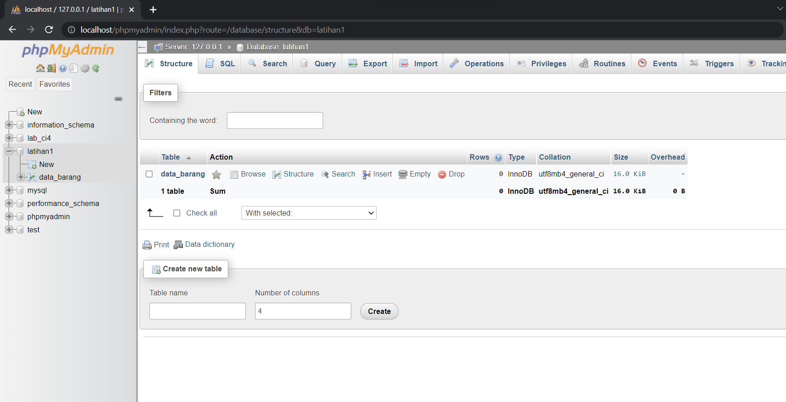
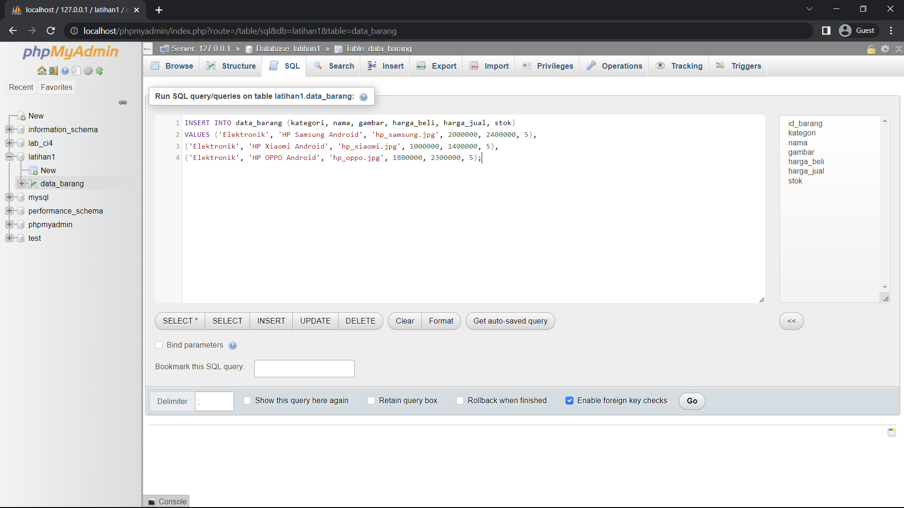
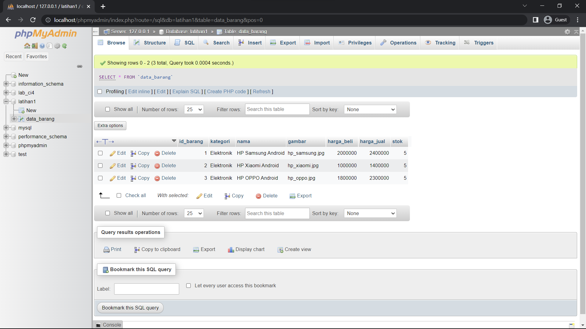
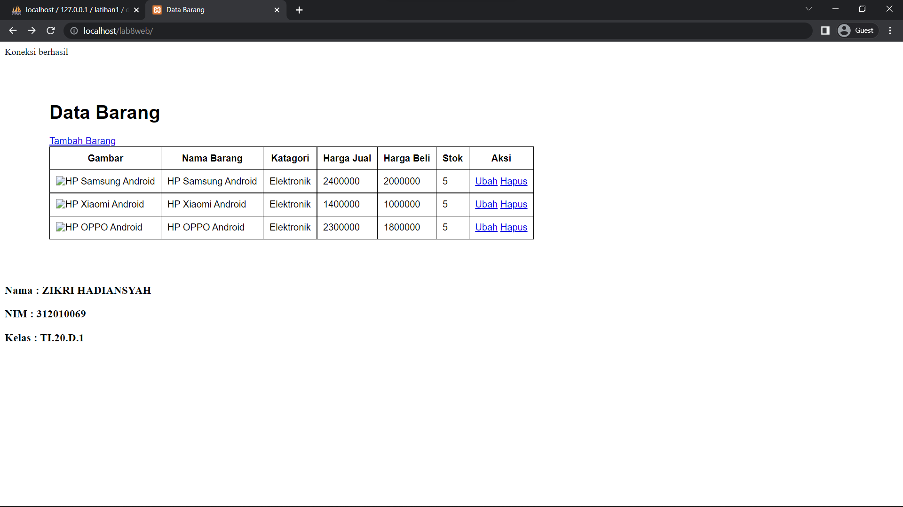
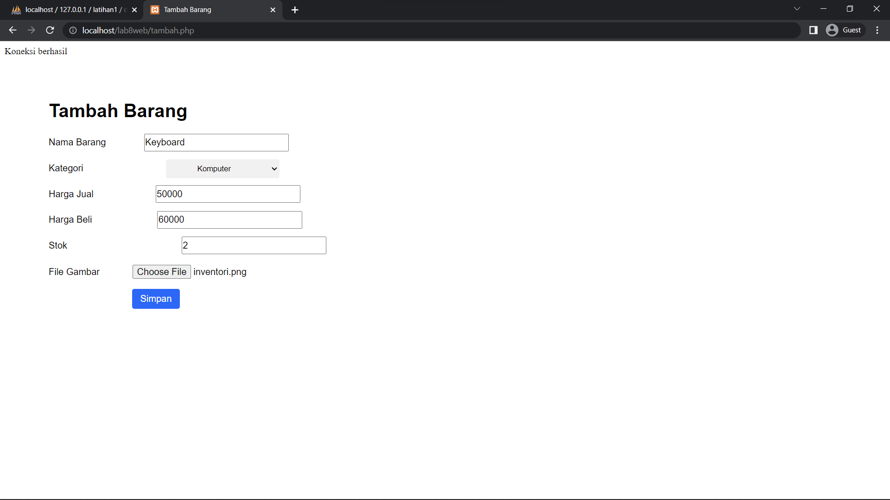
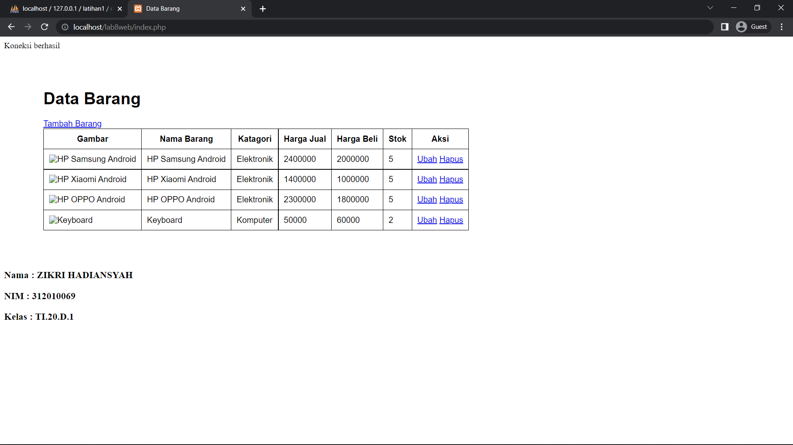
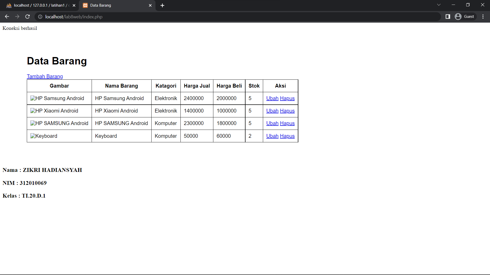
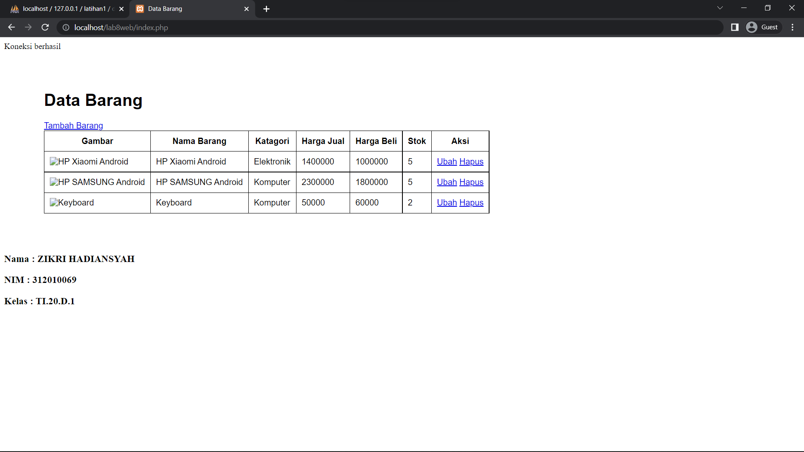
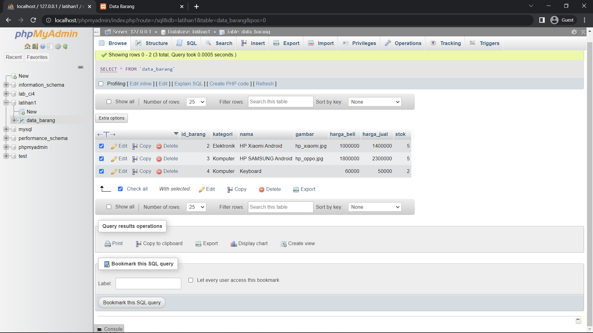

# Lab8Web
### Tampilan Database yang sudah saya buat 
- Mengunakan Perintah CREATE DATABES latihan1; (nama databesnya) dan untuk membuat table dengan menggunakan perintah SQL yaitu CREATE TABLE data_barang(nama tabell).

### Lalu Jika sudah dibuat databesnya dan isi data di tabelnya, koneksikan web(php) ke databes, berkikut hasil dari konfigarasi php(CRUD) ke databese MYSQL :

- Tampilan yang sudah koneksi ke data base

- Tampilan Tambah Barang 

- Tampilan Ubah Barang

- Tampilan Hapus Barang

